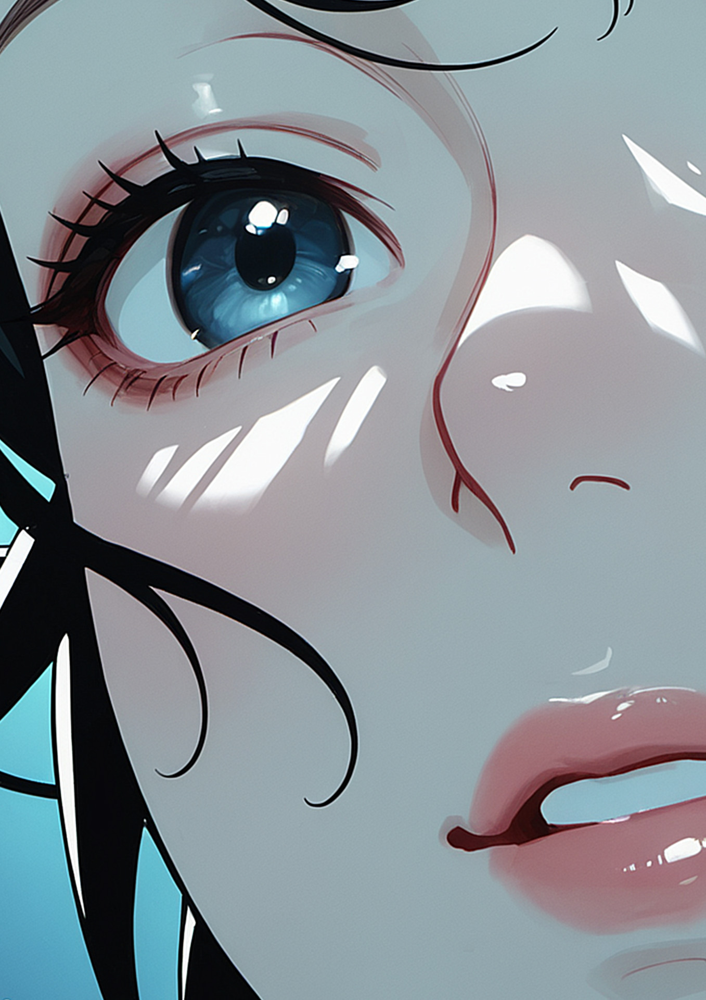
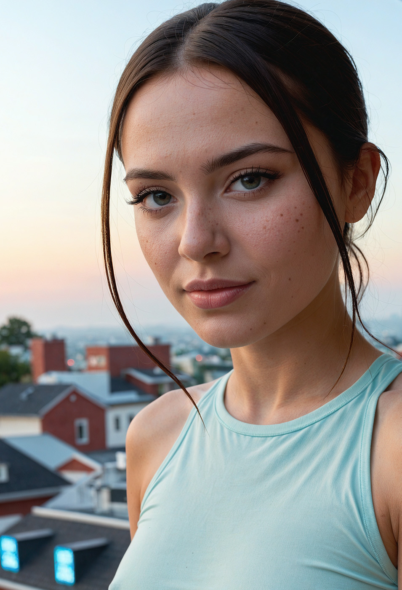
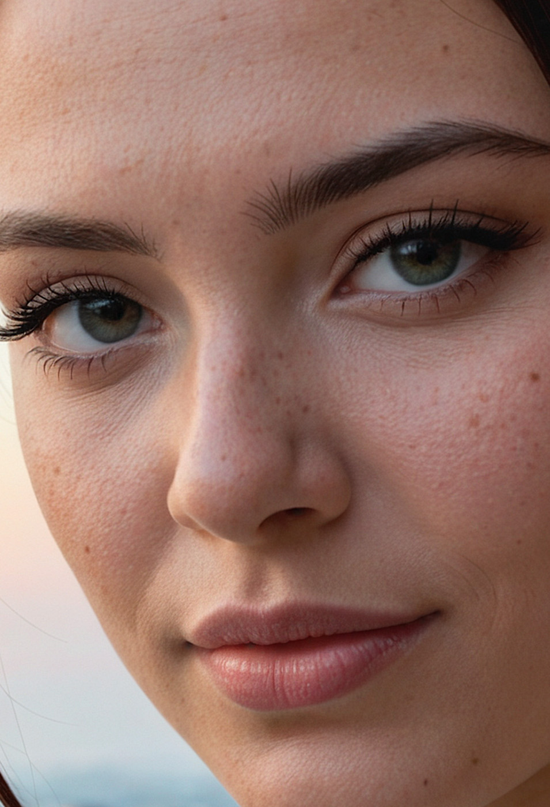
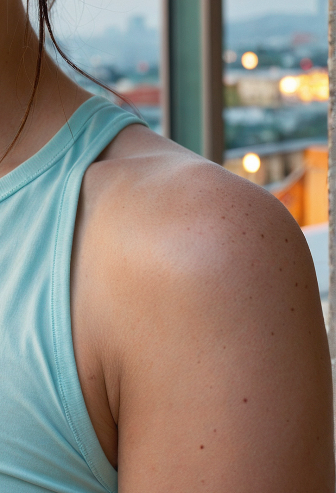
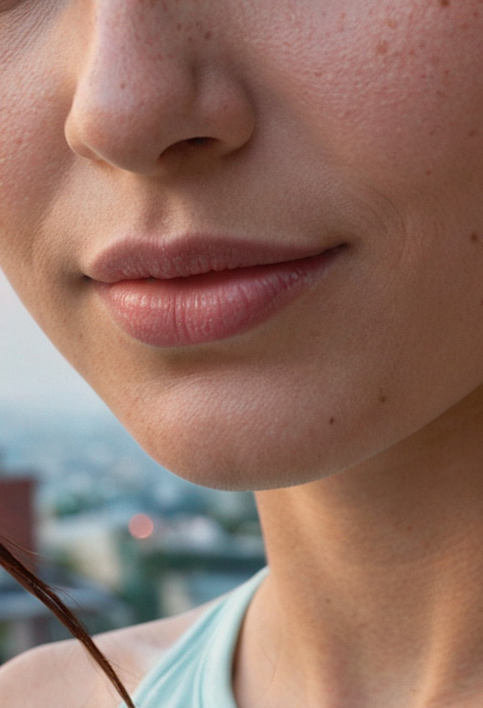
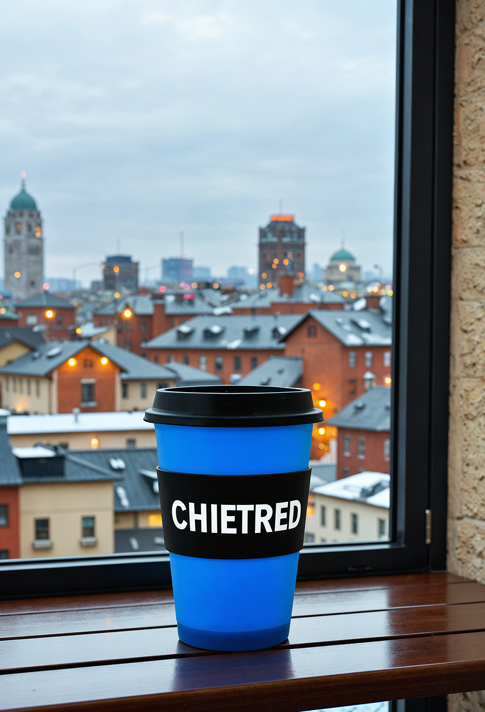
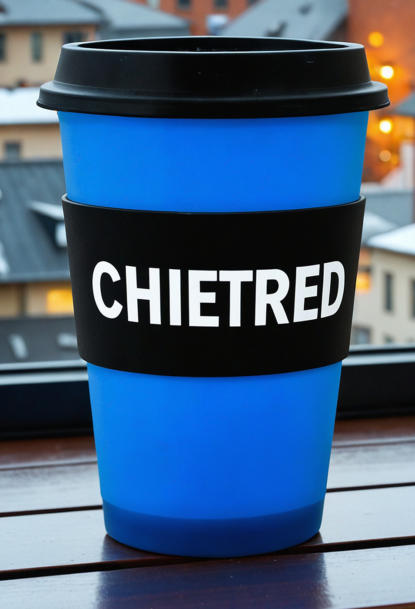
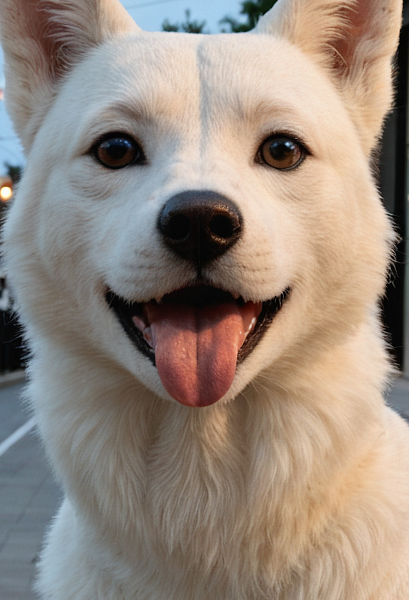
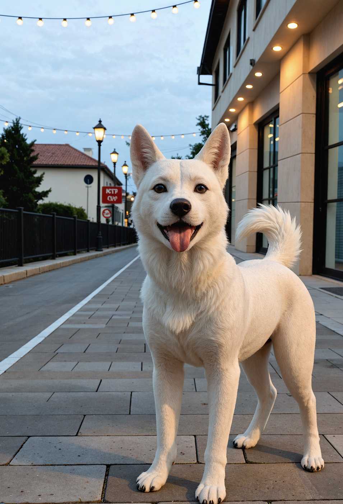

# MagicNodes — ComfyUI Render Pipeline (SD/SDXL)
Simple start. Expert-grade results. Reliable detail.
[](https://arxiv.org/abs/2510.12954) / [](https://arxiv.org/pdf/2510.15761)

<table>
  <tr>
    <td width="140" valign="top">
      
    </td>
    <td>
TL;DR: MagicNodes, it's a plug-and-play multi-pass "render-machine" for SD/SDXL models. Simple one-node start, expert-grade results. Core is ZeResFDG (Frequency-Decoupled + Rescale + Zero-Projection)  and the always-on QSilk Micrograin Stabilizer, complemented by practical stabilizers (NAG, local masks, EPS, Muse Blend, Polish). Ships with a four-pass preset for robust, clean, and highly detailed outputs.

Our pipeline runs through several purposeful passes: early steps assemble global shapes, mid steps refine important regions, and late steps polish without overcooking the texture. We gently stabilize the amplitudes of the "image’s internal draft" (latent) and adapt the allowed value range per region: where the model is confident we give more freedom, and where it’s uncertain we act more conservatively. The result is clean gradients, crisp edges, and photographic detail even at very high resolutions and, as a side effect on SDXL models, text becomes noticeably more stable and legible.
  </tr>
</table>

Please note that the SDXL architecture itself has limitations and the result depends on the success of the seed, the purity of your prompt and the quality of your model+LoRA.

Draw
<div align="center">
  
  
  
</div>

Photo Portrait
<div align="center">
  
  
</div>
<div align="center">
  
  
</div>

Photo Cup
<div align="center">
  
  
</div>

Photo Dog
<div align="center">
  
  
</div>

---

## Features
- ZeResFDG: LF/HF split, energy rescale, and zero-projection (stable early, sharp late)
- NAG (Normalized Attention Guidance): small attention variance normalization (positive branch)
- Local spatial gating: optional CLIPSeg masks for faces/hands/pose
- EPS scale: small early-step exposure bias
- QSilk Micrograin Stabilizer: gently smooths rare spikes and lets natural micro-texture (skin, fabric, tiny hairs) show through — without halos or grid patterns. Always on, zero knobs, near‑zero cost.
- Adaptive Quantile Clip (AQClip): softly adapts the allowed range per region. Confident areas keep more texture; uncertain ones get cleaner denoising. Tile‑based with seamless blending (no seams). Optional Attn mode uses attention confidence for an even smarter balance.
- MGHybrid scheduler: hybrid Karras/Beta sigma stack with smooth tail blending and tiny schedule jitter (ZeSmart-inspired) for more stable, detail-friendly denoising; used by CADE and SuperSimple by default
- Seed Latent (MG_SeedLatent): fast, deterministic latent initializer aligned to VAE stride; supports pure-noise starts or image-mixed starts (encode + noise) to gently bias content; batch-ready and resolution-agnostic, pairs well with SuperSimple recommended latent sizes for reproducible pipelines
- Muse Blend and Polish: directional post-mix and final low-frequency-preserving clean-up
- SmartSeed (CADE Easy and SuperSimple): set `seed = 0` to auto-pick a good seed from a tiny low-step probe. Uses a low-discrepancy sweep, avoids speckles/overexposure, and, if available, leverages CLIP-Vision (with `reference_image`) and CLIPSeg focus text to favor semantically aligned candidates. Logs `Smart_seed_random: Start/End`. 
<b>I highly recommend working with SmartSeed.</b>
- CADE2.5 pipeline does not just upscale the image, it iterates and adds small details, doing it carefully, at every stage.

## Hardware Requirements
- GPU VRAM: ~10-28 GB (free memory) for the default presets (start latent ~ 672x944 -> final ~ 3688x5192 across 4 steps). 15-25 GB is recommended; 32 GB is comfortable for large prompts/batches.
- System RAM: ~12-20 GB during generation (depends on start latent and whether Depth/ControlFusion are enabled). 16+ GB recommended.
- Notes
  - Lowering the starting latent (e.g., 512x768) reduces both VRAM and RAM.
  - Disabling hi-res depth/edges (ControlFusion) reduces peaks. (not recommended!)
  - Depth weights add a bit of RAM on load; models live under `depth-anything/`. 


## Install (ComfyUI 0.3.60, tested on this version)
Preparing:
I recomend update pytorch version: 2.8.0+cu129.
1. PyTorch install: `pip install torch==2.8.0 torchvision==0.23.0 torchaudio==2.8.0 --index-url https://download.pytorch.org/whl/cu129`
2. CUDA manual download and install: https://developer.nvidia.com/cuda-12-9-0-download-archive?target_os=Windows&target_arch=x86_64&target_version=11&target_type=exe_local
3. Install `SageAttention 2.2.0`, manualy `https://github.com/thu-ml/SageAttention` or use script `scripts/check_sageattention.bat`. The installation takes a few minutes, wait for the installation to finish.

Next:
1. Clone or download this repo into `ComfyUI/custom_nodes/`
2. Install helpers: `pip install -r requirements.txt`
3. Take my negative LoRA `models/LoRA/mg_7lambda_negative.safetensors` and place the file in ComfyUI, to `ComfyUI/models/loras`
4. download model `depth_anything_v2_vitl.pth` https://huggingface.co/depth-anything/Depth-Anything-V2-Large/tree/main and place inside in to `depth-anything/` folder.
5. Workflows
Folder `workflows/` contains ready-to-use graphs:
- `mg_SuperSimple-Workflow.json` — one-node pipeline (2/3/4 steps) with presets
- `mg_Easy-Workflow.json` — the same logic built from individual Easy nodes
You can save this workflow to ComfyUI `ComfyUI\user\default\workflows`
6. Restart ComfyUI. Nodes appear under the "MagicNodes" categories.

💥 I strongly recommend use `mg_Easy-Workflow` workflow + default settings + your model and my negative LoRA `mg_7lambda_negative.safetensors`, for best result.


## 🚀 "One-Node" Quickstart (MG_SuperSimple)
Start with `MG_SuperSimple` for the easiest path:
1. Drop `MG_SuperSimple` into the graph
2. Connect `model / positive / negative / vae / latent` and a `Load ControlNet Model` module
3. Choose `step_count` (2/3/4) and Run

or load `mg_SuperSimple-Workflow` in panel ComfyUI

Notes:
- When "Custom" is off, presets fully drive parameters
- When "Custom" is on, the visible CADE controls override the Step presets across all steps; Step 1 still enforces `denoise=1.0`
- CLIP Vision (if connected) is applied from Step 2 onward; if no reference image is provided, SuperSimple uses the previous step image as reference

## ❗Tips
(!) There are almost always artifacts in the first step, don't pay attention to them, they will be removed in the next steps. Keep your prompt clean and logical, don't duplicate details and be careful with symbols.

0) `MG_SuperSimple-Workflow` is a bit less flexible than `MG_Easy-Workflow`, but extremely simple to use. If you just want a stable, interesting result, start with SuperSimple.

1) Recommended negative LoRA: `mg_7lambda_negative.safetensors` with `strength_model = -1.0`, `strength_clip = 0.2`. Place LoRA files under `ComfyUI/models/loras` so they appear in the LoRA selector.

2) Download a CLIP Vision model and place it under `ComfyUI/models/clip_vision` (e.g., https://huggingface.co/openai/clip-vit-large-patch14; heavy alternative: https://huggingface.co/laion/CLIP-ViT-H-14-laion2B-s32B-b79K). SuperSimple/CADE will use it for reference-based polish.

3) Samplers: i recomend use `ddim` for many cases (Draw and Realism style). Scheduler: use `MGHybrid` in this pipeline.

4) Denoise: higher -> more expressive and vivid; you can go up to 1.0. The same applies to CFG: higher -> more expressive but may introduce artifacts. Suggested CFG range: ~4.5–8.5.

5) If you see unwanted artifacts on the final (4th) step, slightly lower denoise to ~0.5–0.6 or simply change the seed.

6) You can get interesting results by repeating steps (in Easy/Hard workflows), e.g., `1 -> 2 -> 3 -> 3`.  Just experiment with it!

7) Recommended starting latent close to ~672x944 (other aspect ratios are fine). With that, step 4 produces ~3688x5192. Larger starting sizes are OK if the model and your hardware allow.

8) Unlucky seeds happen — just try another. (We may later add stabilization to this process.)

9) Rarely, step 3 can show a strange grid artifact (in both Easy and Hard workflows). If this happens, try changing CFG or seed. Root cause still under investigation.

10) Results depend on checkpoint/LoRA quality. The pipeline “squeezes” everything SDXL and your model can deliver, so prefer high‑quality checkpoints and non‑overtrained LoRAs.

11) Avoid using more than 3 LoRAs at once, and keep only one “lead” LoRA (one you trust is not overtrained). Too many/strong LoRAs can spoil results.

12) Try connecting reference images in either workflow — you can get unusual and interesting outcomes.

13) Very often, the image in `step 3 is of very good quality`, but it usually lacks sharpness. But if you have a `weak system`, you can `limit yourself to 3 steps`.

14) SmartSeed (auto seed pick): set `seed = 0` in Easy or SuperSimple. The node will sample several candidate seeds and do a quick low‑step probe to choose a balanced one. You’ll see logs `Smart_seed_random: Start` and `Smart_seed_random: End. Seed is: <number>`. Use any non‑zero seed for fully deterministic runs.

15) The 4th step sometimes saves the image for a long time, just wait for the end of the process, it depends on the initial resolution you set.


## Repository Layout
```
MagicNodes/
├─ README.md
├─ LICENSE                      # AGPL-3.0-or-later
├─ assets/
├─ docs/
│  ├─ EasyNodes.md
│  ├─ HardNodes.md
│  └─ hard/
│     ├─ CADE25.md
│     ├─ ControlFusion.md
│     ├─ UpscaleModule.md
│     ├─ IDS.md
│     └─ ZeSmartSampler.md
│ 
├─ mod/
│  ├─ easy/
│  │  ├─ mg_cade25_easy.py
│  │  ├─ mg_controlfusion_easy.py
│  │  └─ mg_supersimple_easy.py
│  │  └─ preset_loader.py
│  └─ hard/
│     ├─ mg_cade25.py
│     ├─ mg_controlfusion.py
│     ├─ mg_tde2.py
│     ├─ mg_upscale_module.py
│     ├─ mg_ids.py
│     └─ mg_zesmart_sampler_v1_1.py
│ 
├─ pressets/
│  ├─ mg_cade25.cfg
│  └─ mg_controlfusion.cfg
│ 
├─ scripts/
│  ├─ check_sageattention.bat
│  └─ check_sageattention.ps1
│ 
├─ depth-anything/              # place Depth Anything v2 weights (.pth), e.g., depth_anything_v2_vitl.pth
│  └─depth_anything_v2_vitl.pth
│ 
├─ vendor/
│  └─ depth_anything_v2/        # vendored Depth Anything v2 code (Apache-2.0)
│ 
├─ models/
│  └─ LoRA/
│     └─ mg_7lambda_negative.safetensors
│ 
├─ workflows/ 
│  ├─ mg_SuperSimple-Workflow.json
│  └─ mg_Easy-Workflow.json           
|  
└─ requirements.txt
```

Models folder
- The repo includes a sample negative LoRA at `models/LoRA/mg_7lambda_negative.safetensors`.
- To use it in ComfyUI, copy or move the file to `ComfyUI/models/loras` — it will then appear in LoRA selectors.
- Keeping a copy under `models/` here is fine as a backup.

Depth models (Depth Anything v2)
- Place DA v2 weights (`.pth`) in `depth-anything/`. Recommended: `depth_anything_v2_vitl.pth` (ViT-L). Supported names include:
  `depth_anything_v2_vits.pth`, `depth_anything_v2_vitb.pth`, `depth_anything_v2_vitl.pth`, `depth_anything_v2_vitg.pth`,
  and the metric variants `depth_anything_v2_metric_vkitti_vitl.pth`, `depth_anything_v2_metric_hypersim_vitl.pth`.
- ControlFusion auto-detects the correct config from the filename and uses this path by default. You can override via the
  `depth_model_path` parameter (preset) if needed.
- If no weights are found, ControlFusion falls back gracefully (luminance pseudo-depth), but results are better with DA v2.
- Where to get weights: see the official Depth Anything v2 repository (https://github.com/DepthAnything/Depth-Anything-V2)
  and its Hugging Face models page (https://huggingface.co/Depth-Anything) for pre-trained `.pth` files.


## Documentation
- Easy nodes overview and `MG_SuperSimple`: `docs/EasyNodes.md`
- Hard nodes documentation index: `docs/HardNodes.md`

## Control Fusion (mg_controlfusion.py, mg_controlfusion_easy.py,)
- Builds depth + edge masks with preserved aspect ratio; hires-friendly mask mode
- Key surface knobs: `edge_alpha`, `edge_smooth`, `edge_width`, `edge_single_line`/`edge_single_strength`, `edge_depth_gate`/`edge_depth_gamma`
- Preview can optionally reflect ControlNet strength via `preview_show_strength` and `preview_strength_branch`

## CADE 2.5 (mg_cade25.py, mg_cade25_easy.py)
- Deterministic preflight: CLIPSeg pinned to CPU; preview mask reset; noise tied to `iter_seed`
- Encode/Decode: stride-aligned, with larger overlap for >2K to avoid artifacts
- Polish mode (final hi-res refinement):
  - `polish_enable`, `polish_keep_low` (global form from reference), `polish_edge_lock`, `polish_sigma`
  - Smooth start via `polish_start_after` and `polish_keep_low_ramp`
- `eps_scale` supported for gentle exposure shaping

## Depth Anything v2 (vendor)
- Lives under `vendor/depth_anything_v2`; Apache-2.0 license

## MG_ZeSmartSampler (Experimental)
- Custom sampler that builds hybrid sigma schedules (Karras/Beta blend) with tail smoothing
- Inputs/Outputs match KSampler: `MODEL/SEED/STEPS/CFG/base_sampler/schedule/CONDITIONING/LATENT` -> `LATENT`
- Key params: `hybrid_mix`, `jitter_sigma`, `tail_smooth`, optional PC2-like shaping (`smart_strength`, `target_error`, `curv_sensitivity`)

## Seed Latent (mg_seed_latent.py)
- Purpose: quick LATENT initializer aligned to VAE stride (4xC, H/8, W/8). Can start from pure noise or mix an input image encoding with noise to gently bias content.
- Inputs
  - `width`, `height`, `batch_size`
  - `sigma` (noise amplitude) and `bias` (additive offset)
  - Optional `vae` and `image` when `mix_image` is enabled
- Output: `LATENT` dict `{ "samples": tensor }` ready to feed into CADE/SuperSimple.
- Usage notes
  - Keep dimensions multiples of 8; recommended starting sizes around ~672x944 (other aspect ratios work). With SuperSimple’s default scale, step 4 lands near ~3688x5192.
  - `mix_image=True` encodes the provided image via VAE and adds noise: a soft way to keep global structure while allowing refinement downstream.
  - For run-to-run comparability, hold your sampler seed fixed (in SuperSimple/CADE). SeedLatent itself does not expose a seed; variation is primarily controlled by the sampler seed.
  - Batch friendly: `batch_size>1` produces independent latents of the chosen size.

## Dependencies (Why These Packages)
- transformers — used by CADE for CLIPSeg (CIDAS/clipseg-rd64-refined) to build text‑driven masks (e.g., face/hands). If missing, CLIPSeg is disabled gracefully.
 
- opencv-contrib-python — ControlFusion edge stack (Pyramid Canny, thinning via ximgproc), morphological ops, light smoothing.
- Pillow — image I/O and small conversions in preview/CLIPSeg pipelines.
- scipy — preferred Gaussian filtering path for IDS (quality). If not installed, IDS falls back to a PyTorch implementation.
- sageattention — accelerated attention kernels (auto-picks a kernel per GPU arch); CADE/attention patch falls back to stock attention if not present.

Optional extras
- controlnet-aux — alternative loader for Depth Anything v2 if you don’t use the vendored implementation (not required by default).
  

## Preprint
- CADE 2.5 - ZeResFDG
- PDF: https://arxiv.org/pdf/2510.12954.pdf
- arXiv: https://arxiv.org/abs/2510.12954

- CADE 2.5 - QSilk
- PDF: https://arxiv.org/pdf/2510.15761
- arXiv: https://arxiv.org/abs/2510.15761


### How to Cite
```
@misc{rychkovskiy2025cade25zeresfdg,
      title={CADE 2.5 - ZeResFDG: Frequency-Decoupled, Rescaled and Zero-Projected Guidance for SD/SDXL Latent Diffusion Models}, 
      author={Denis Rychkovskiy},
      year={2025},
      eprint={2510.12954},
      archivePrefix={arXiv},
      primaryClass={cs.CV},
      url={https://arxiv.org/abs/2510.12954}, 
}
```
```
@misc{rychkovskiy2025qsilkmicrograinstabilizationadaptive,
      title={QSilk: Micrograin Stabilization and Adaptive Quantile Clipping for Detail-Friendly Latent Diffusion}, 
      author={Denis Rychkovskiy},
      year={2025},
      eprint={2510.15761},
      archivePrefix={arXiv},
      primaryClass={cs.CV},
      url={https://arxiv.org/abs/2510.15761}, 
}
```

## Attribution (kind request)
If you use this work or parts of it, please consider adding the following credit in your README/About/credits: "Includes CADE 2.5 (ZeResFDG, QSilk) by Denis Rychkovskiy (“DZRobo”)"


## License and Credits
- License: AGPL-3.0-or-later (see `LICENSE`)


## Support
If this project saved you time, you can leave a tip:
- GitHub Sponsors: https://github.com/sponsors/1dZb1
- Bymeacoffee: https://buymeacoffee.com/dzrobo


